# Theme Guide

`code-renderer` supports the themes bundled with Shiki. Select one with
`--theme`; the default is `github-light`.

```bash
code-render main.rs --theme catppuccin-mocha
code-render main.rs --theme github-dark --line-numbers --width 1200
```

Theme names are case-insensitive. An unknown name causes the command to fail
instead of silently using a different theme.

## Popular Themes

All examples below were rendered by `code-render` from the same Rust source.

### GitHub Light

Theme ID: `github-light`

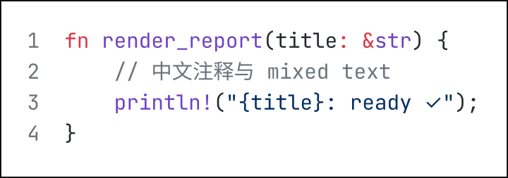

### GitHub Dark

Theme ID: `github-dark`

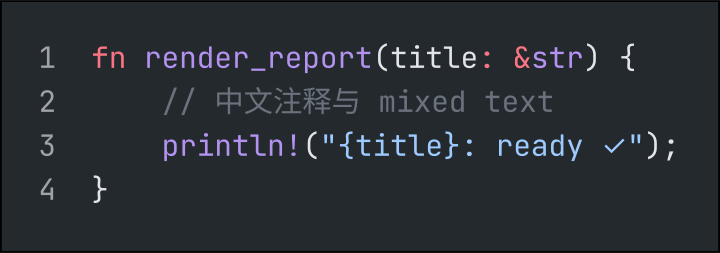

### Catppuccin Latte

Theme ID: `catppuccin-latte`

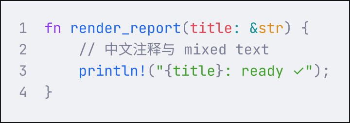

### Catppuccin Mocha

Theme ID: `catppuccin-mocha`

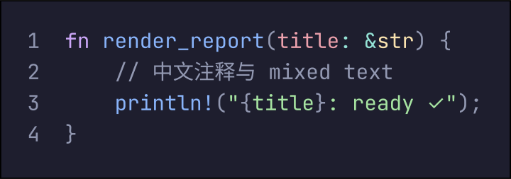

### Dracula

Theme ID: `dracula`

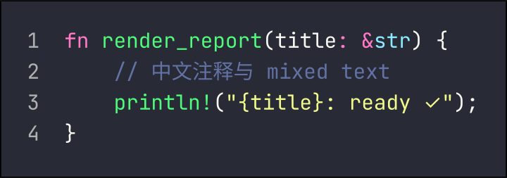

### Nord

Theme ID: `nord`

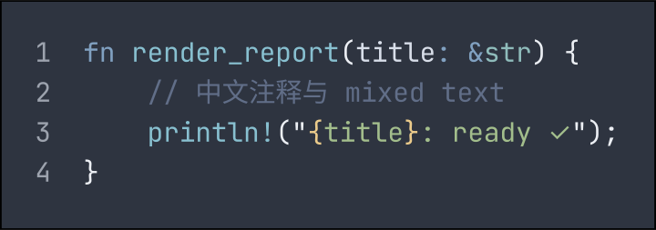

### One Dark Pro

Theme ID: `one-dark-pro`

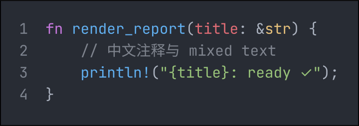

### Tokyo Night

Theme ID: `tokyo-night`

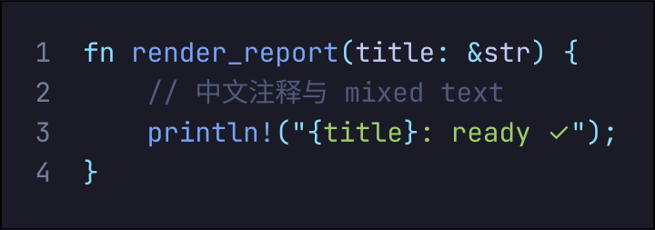

### Gruvbox Dark Medium

Theme ID: `gruvbox-dark-medium`

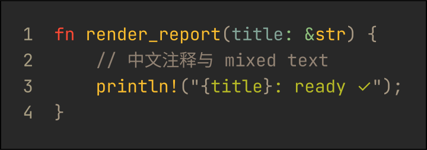

### Solarized Light

Theme ID: `solarized-light`

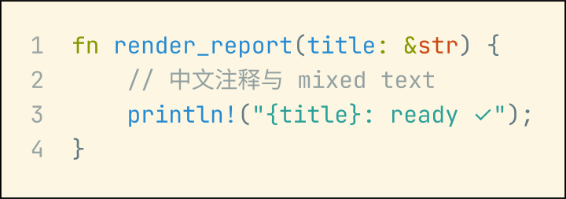

### Rose Pine

Theme ID: `rose-pine`

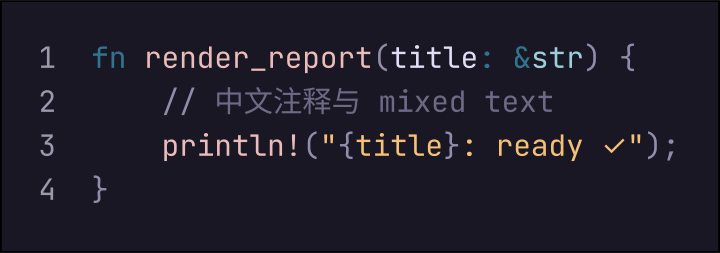

### Material Theme Palenight

Theme ID: `material-theme-palenight`

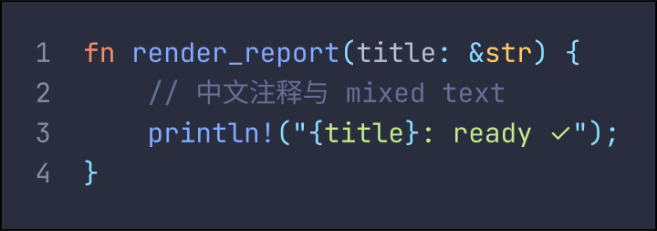

## All Available Theme IDs

```text
andromeeda
aurora-x
ayu-dark
ayu-light
ayu-mirage
catppuccin-frappe
catppuccin-latte
catppuccin-macchiato
catppuccin-mocha
dark-plus
dracula
dracula-soft
everforest-dark
everforest-light
github-dark
github-dark-default
github-dark-dimmed
github-dark-high-contrast
github-light
github-light-default
github-light-high-contrast
gruvbox-dark-hard
gruvbox-dark-medium
gruvbox-dark-soft
gruvbox-light-hard
gruvbox-light-medium
gruvbox-light-soft
horizon
horizon-bright
houston
kanagawa-dragon
kanagawa-lotus
kanagawa-wave
laserwave
light-plus
material-theme
material-theme-darker
material-theme-lighter
material-theme-ocean
material-theme-palenight
min-dark
min-light
monokai
night-owl
night-owl-light
nord
one-dark-pro
one-light
plastic
poimandres
red
rose-pine
rose-pine-dawn
rose-pine-moon
slack-dark
slack-ochin
snazzy-light
solarized-dark
solarized-light
synthwave-84
tokyo-night
vesper
vitesse-black
vitesse-dark
vitesse-light
```

The available set follows the bundled themes in the installed Shiki version.
